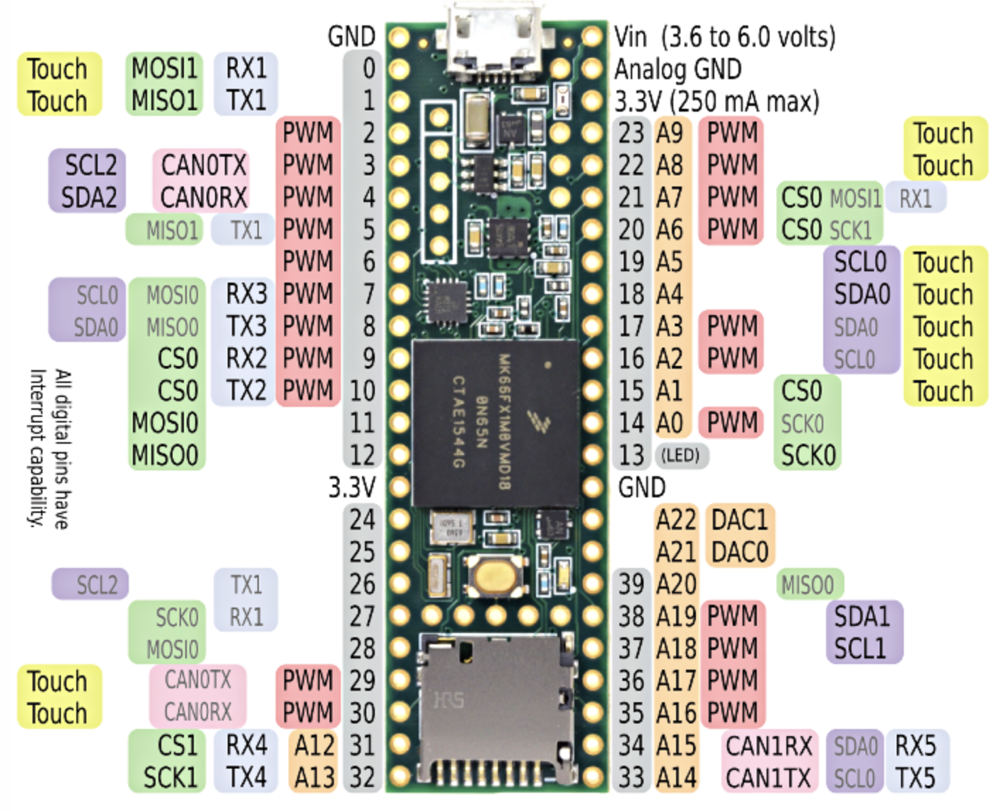

# cs140e_teensy
I reimplemented some of the CS140E labs using the Teensy 3.2. The main references I used are [K20 sub-family reference](https://www.pjrc.com/teensy/K20P64M72SF1RM.pdf), the [Teensy website with schematics and technical specifications](https://www.pjrc.com/), the [ARM Cortex-M4 reference manual](http://infocenter.arm.com/help/topic/com.arm.doc.dui0553b/DUI0553.pdf), and [David Welch's Teensy examples](https://github.com/dwelch67/teensy_samples). 

To run these labs, I had an LED connected to pin 12 (and ground), and I also connected to pins 0/1 for the UART RX/TX. The Teensy has a convenient LED by pin 13 so you don't necessarily have to hook up additional LEDs if just one is enough. 

Additionally, to actually send code to the Teensy, I used the provided bootloader: https://www.pjrc.com/teensy/loader_cli.html. The command is:
>teensy_loader_cli -mmcu=mk20dx256 -w [hex_file].hex

To make things easier, in my .bash_profile, I made an alias that points to the location of the command line loader so all I have to run is 

>teensy [hex_file].hex

To add the alias, you have to put the following in your .bashrc or .bash_profile:
>alias teensy="/Users/christinali/Documents/Stanford/JuniorYear/WinterQtr/CS140E/Teensy3x/teensy_loader_cli -mmcu=mk20dx256 -w -v"

## [Lab01-blinker](lab1-blink-teensy)
Blinking an LED (pin 13) on/off using a while loop delay.

## [Lab02-bootloader](lab2-bootloader-teensy)
Bootloader to send code from the computer to the Teensy using a UART protocol, instead of over USB with the command line. Because none of our code is flashed onto the Teensy, you have to first send the Teensy-side code over first with the command line interface (USB), then you can run the unix-side and send whatever code (blink.bin from lab01 is provided).

## [Lab03-uart](lab3-uart-teensy)
Sending bytes from the Teensy to the computer to print something.

## [Lab07-timer-interrupts](lab7-interrupts-teensy)
Using timer interrupts to blink an LED instead of using a loop.
