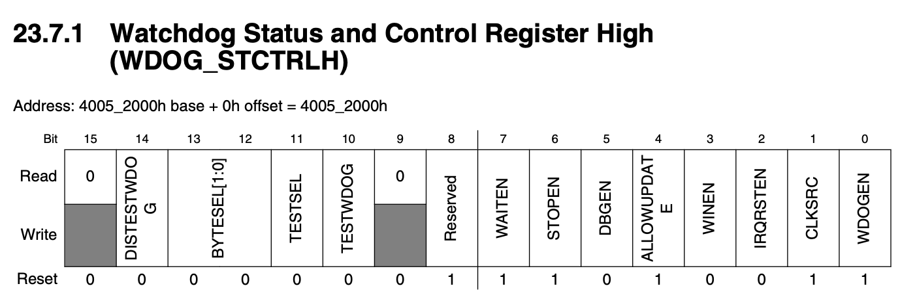
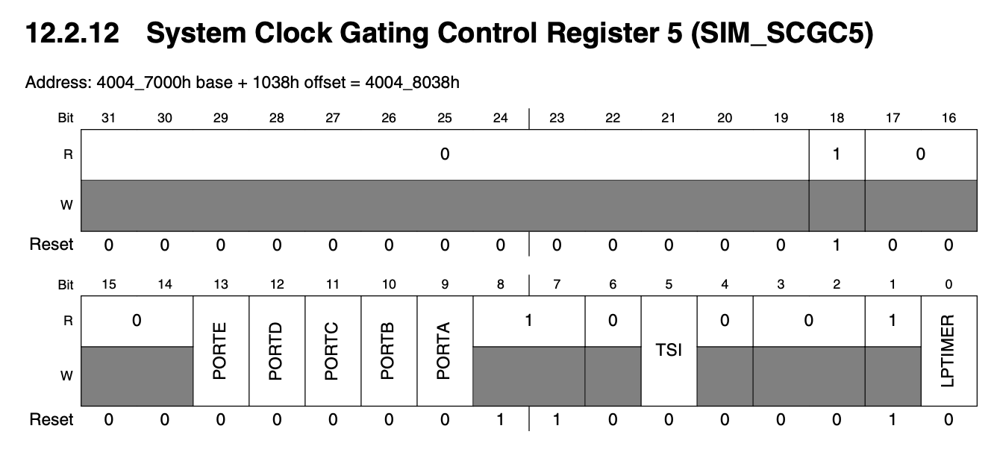
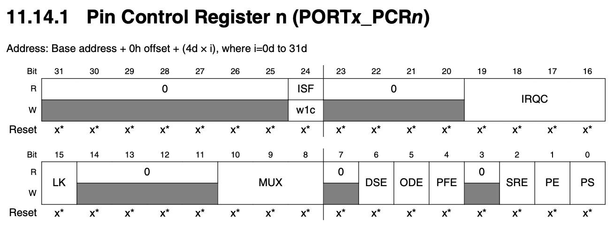
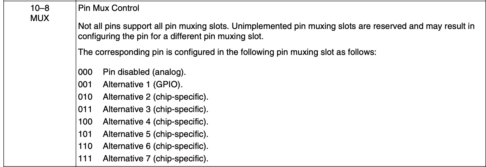
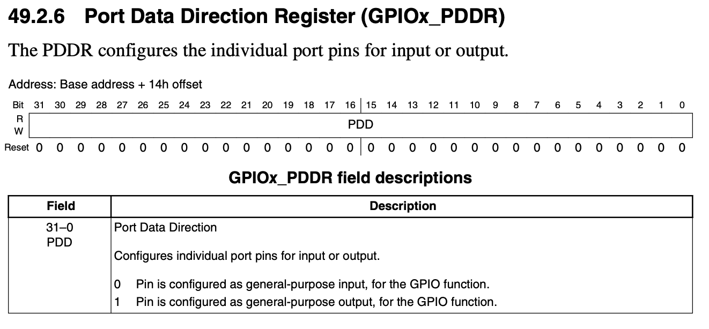
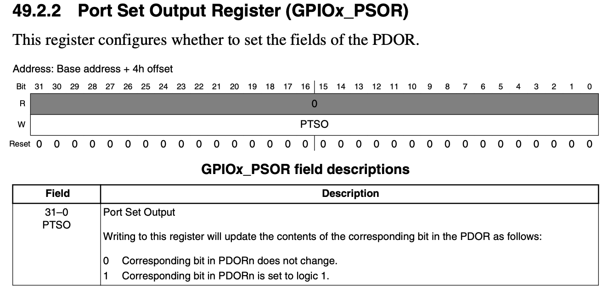
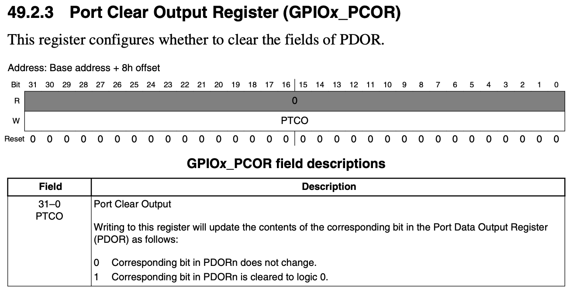

# Lab01-blink

See the README one level up about where to find the reference manual
and schematics for the board.

blinker01 enables pin 13 (C5) as an output and then uses a simple count loop to delay between the led state changes.

## Code logic
1. Turn off the watchdog, which could reset the Teensy if you try to change the control and configuration registers. 
2. Enable GPIO, set pin 13 (C5) to an output pin. 
3. In a while loop, switch between setting the LED (turning it off) and clearing it (turning it off), delaying in between so we can actually see it blink.

To do all, we're using assembly routines like PUT32, GET32, etc to directly put load or store values into the specified registers. 

## Important registers
### Watchdog
To unlock the watchdog, we have to write 0xC520 followed by 0xD928 within 20 bus clock cycles to a specific unlock
register (WDOG_UNLOCK).

Change WDOG_STCTRLH (Watchdog Status and Control Register High) to use an alternate clock source (not Watchdog timer). (p.474-475)

### GPIO
Set port C (we're using C5) to be a GPIO pin using SIM_SCGC5. (p.254-255)

Set pin control register C to be alternative 1 (GPIO). (p.227-228)

Configure the individual port pin 5 for output. (p.1337)

Set the pin (turn LED on) for specifically pin 5. (p.1335)

Clear the pin (turn LED off) for specifically pin 5. (p.1336)

