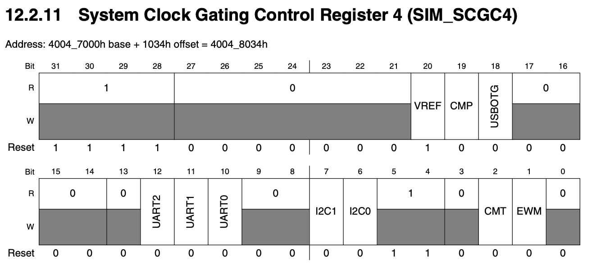
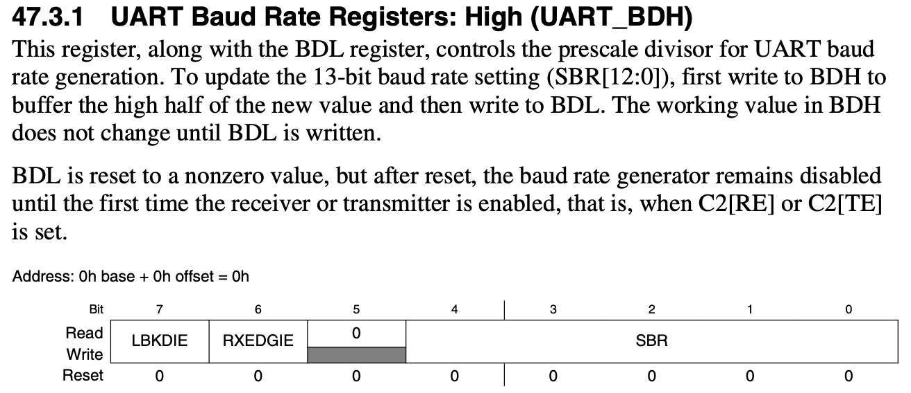
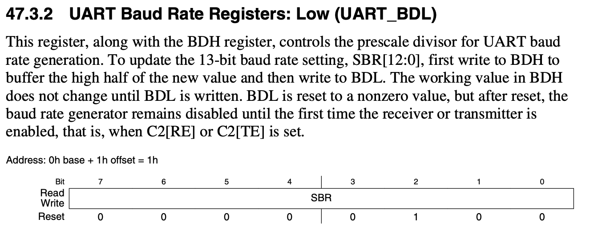
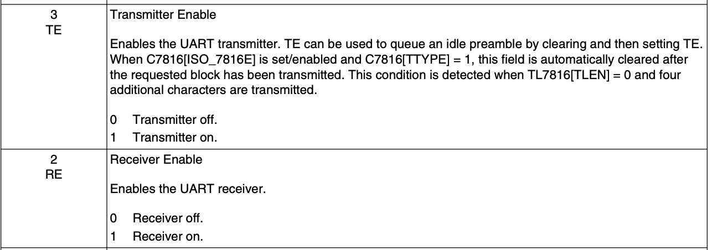

# Lab03-uart

See the README one level up about where to find the reference manual and schematics for the board.

Send a string over UART from the Teensy to the computer.

## Code logic
1. Turn off the watchdog, which could reset the Teensy if you try to change the control and configuration registers. 
2. Enable GPIO, set pin 13 (C5) to an output pin. 
3. Switch to 96MHz for the clock speed and different modes for the MCG (multipurpose clock generator). (p.485)
4. Enable Port B for the TX/RX pins, then specifically use the UART transmit mode for the TX pin (alternative 3).
5. Set the baud rate with dividers (see note below about baud rate).
6. Enable the transmitter
7. Timer setup (more about this in [lab7-interrupts](../lab7-interrupts-teensy))
8. While loop to keep printing "hello world"

To do all, we're using assembly routines like PUT32, GET32, etc to directly put load or store values into the specified registers. 

### Baud rate notes (dwelch)
UART baud rate = UART module clock / (16 × divisor)
divisor = UART module clock / (16 × baud)
96000000/(16 x baud) = 52.08 = 0x34
.08 * 32 = 2.56 so we want a fraction of 3

What if we thought in terms of 32nds of a divisor rather than the divisor...
divisor32 = (UART module clock / (16 × baud)) * 32
divisor32 = (UART module clock * 2) / baud
divisor32 = 96000000 * 2 / 115200 = 1666.6
round up
divisor32 = 1667 = 0x683
011010000011
0110100 00011
divisor of 0x34 with a remainder of 3
fraction is divisor32 & 0x1F
lower 8 bits of divisor = (divisor32 >> 5)&0xFF
upper 5 bits of divisor = (divisor32 >> 13)&0x1F

## Important registers
### Set up clock speed
- **OSC_CR**: oscilliscope control register, set certain capacitor loads (p.527-528)

- **MCG_x**: registers to manipulate for different modes for the MCG, read about different modes in reference manual. This code was from dwelch. (p.485)

### UART
- **SIM_SCG4**: Enable UART0 and Port B for TX/RX pins. (p.252)

- **UART0_BDH, UART0_BDL, UART0_C4**: Enable the baud rate to be 115200 (p.1208-1210, p.1221-1222)

- **UART0_C2**: Enable the UART transmitter (p.1211-1212)

### Timer
- **STK_CSR, STK_RVR**
Read [lab7 README](../lab7-interrupts-teensy)

