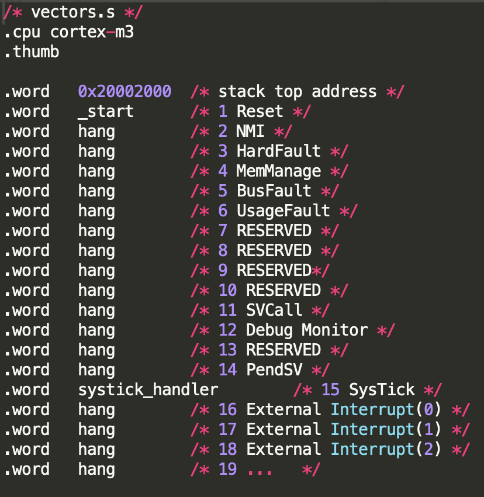
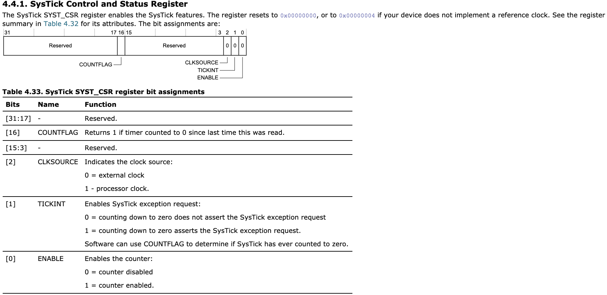
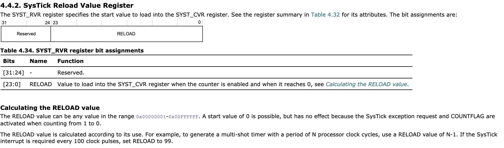
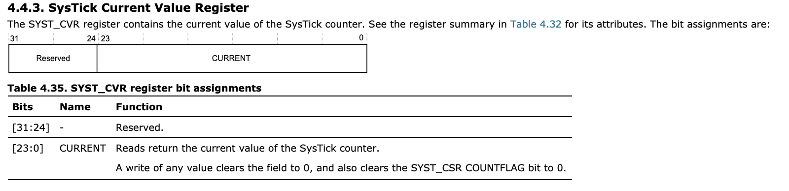

# Lab07-interrupts

See the README one level up about where to find the reference manual and schematics for the board.

Send a string over UART from the Teensy to the computer.

## Code logic
1. UART initialization (read [lab3-uart](../lab3-uart-teensy) for more detail)
2. Set up systick_handler() to be called

3. Inside systick_handler, increment a count (systick_interrupt_count).
4. In the current_time helper function, always gets the most current value of systick_interrupt_count.
5. In teensy_delay, stay in the loop until the timer count has incremented delay_time ticks. The count incremenets whenever the Systick timer interrupt goes off.
6. In the blink code, turn the LED on and off with the delay that uses the timer interrupt in order to escape.

### Context switching
For interrupts, usually you would have to save all the registers so they don't get destroyed, which requires writing in assembly. However, with ARM, registers r0-r3, r12, r12 (link register), and xPSR (program status register) are automatically saved ([source](https://www.embeddedrelated.com/showarticle/912.php)). Because we're only incrementing one variable in the Systick interrupt and doing nothing else, we're only using registers r2 and r3, which are preserved.

## Important registers

### Timer
- **STK_CSR**: enables the processor clock, Systick exception request, and the counter

- **STK_RVR**: specifies start value to load into the signal

- **STK_CVR**: current value of the Systick counter

